# Practice 1.
Add robots and local machine:
   1. Create UiPath account
   2. Open orchestrator
   3. Add machine
   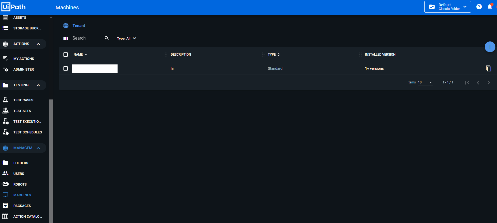

   4. Add robots
   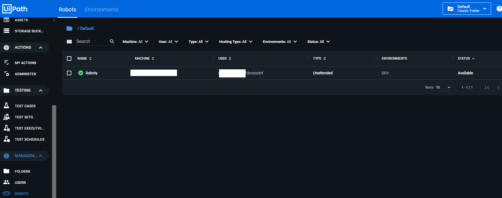

   5. Connect lochal machine to orchestrator
   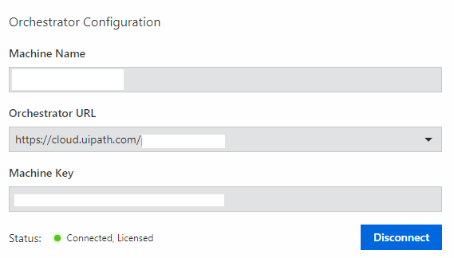

# Practice 2

Publish package:

1. Open local UiPath studio project
2. Click publish button
   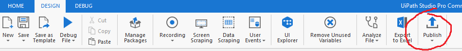

3. Type name of published package (You can change version too)
   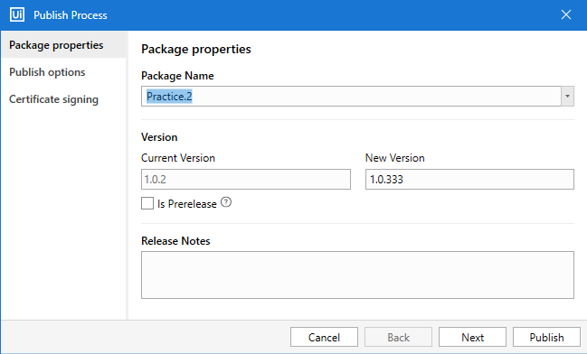
4. In Publish option choose orchestrator
   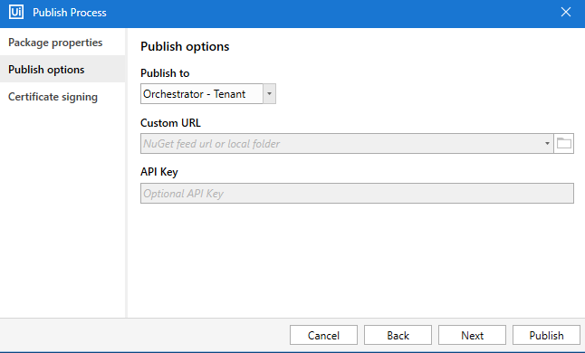
5. Click publish button

# Practice 3

Crate and run a job:

1. Add environment
   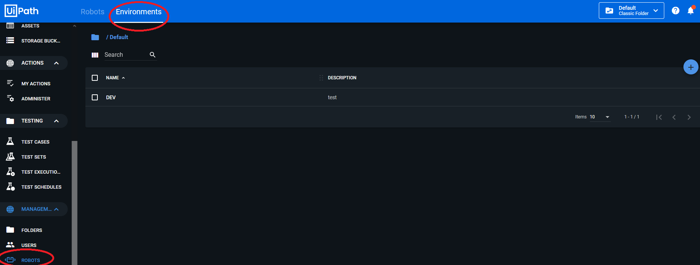

2. Add robots to environment in the same window
3. Create process
   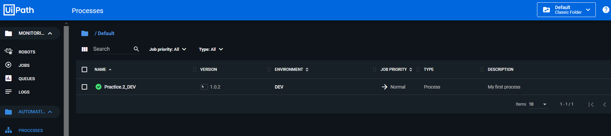
4. Create job
   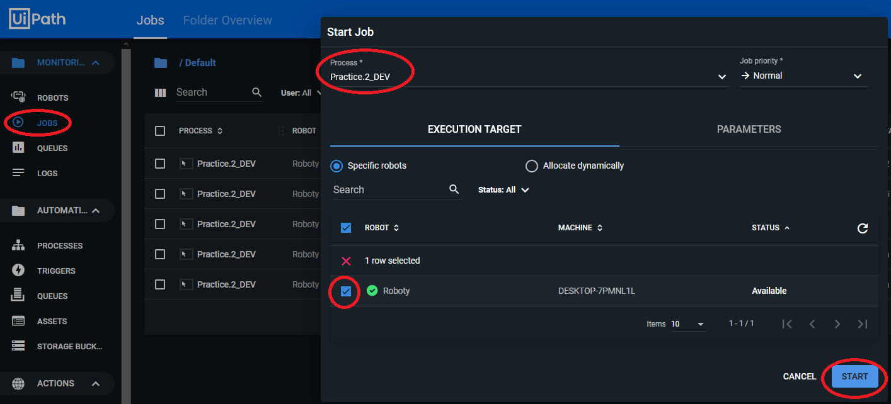
5. Run job and see if your automations is working

# Practice 4

Update package:

1. Change something in your package in UiPathStudio
2. Publish it again (see how version changed)
3. Change process used package to new version 
   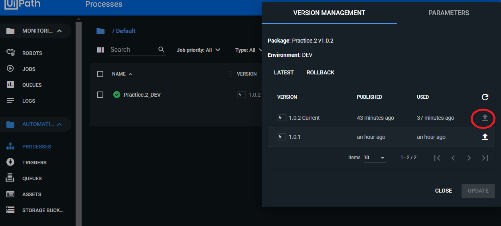
4. Create a new job and see if your changed are involved

# Practice 5

There are similar steps as in Practice 4, but insted of change usage version you need to update version of process then you can re-run the jobs and see if it's work.

# Practice 6

Schedules can be done by triggers.
   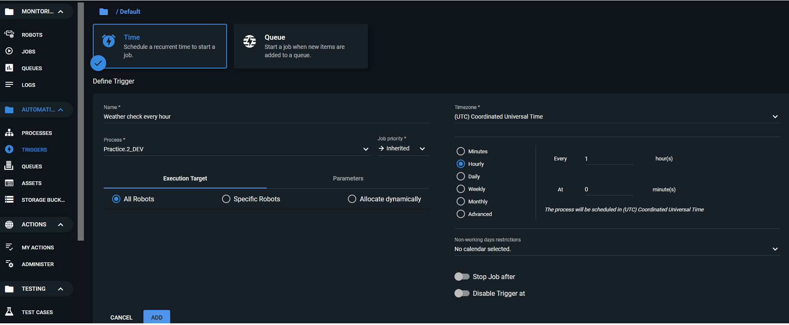

